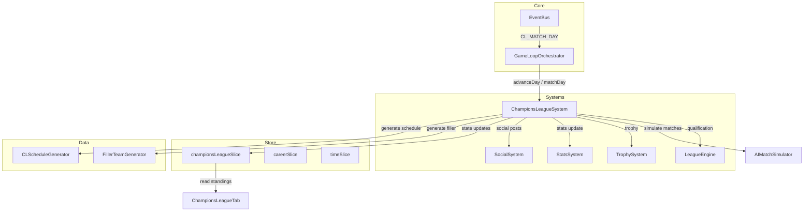

# Design Document: Champions League

## Overview

Ce document décrit la conception technique de l'intégration de la Ligue des Champions dans le jeu de carrière footballistique. Le système ajoute une compétition européenne complète avec phase de ligue (50 équipes, 8 matchs chacune) et tours à élimination directe (huitièmes, quarts, demi-finales, finale), intercalée dans le calendrier existant (mardi/mercredi).

La conception s'appuie sur l'architecture existante :
- Un nouveau système `ChampionsLeagueSystem` dans `src/systems/championsLeague/`
- Un nouveau slice Zustand `championsLeagueSlice` pour l'état
- Intégration avec le `GameLoopOrchestrator` existant pour la gestion des jours de match
- Réutilisation du `AIMatchSimulator` pour la simulation des matchs hors joueur
- Extension du `TrophySystem` pour le trophée Champions League

### Décisions de conception clés

1. **Phase de ligue Swiss-style simplifiée** : Chaque équipe joue 8 matchs contre 8 adversaires différents (4 dom / 4 ext). Le tirage est aléatoire mais respecte la contrainte d'unicité des adversaires.
2. **Équipes filler** : 30 équipes fictives générées avec nom, pays et note moyenne pour compléter les 50 participants. Stockées en mémoire uniquement pendant la saison CL active.
3. **Calendrier intercalé** : Les matchs CL sont planifiés sur les mardis/mercredis entre septembre et mai, sans conflit avec les matchs de championnat du joueur.
4. **Simulation réaliste** : Réutilisation du pattern `AIMatchSimulator` avec pondération par note d'effectif pour des scores entre 0-5 buts.

## Architecture



### Flux principal

1. **Fin de saison** : `GameLoopOrchestrator` émet `SEASON_END` → `ChampionsLeagueSystem.qualify()` détermine les 20 qualifiés + 30 fillers
2. **Début de saison** : `ChampionsLeagueSystem.initSeason()` génère le tirage de la phase de ligue et le calendrier intercalé
3. **Jour de match CL** : `GameLoopOrchestrator.advanceDay()` détecte un match CL → propose "Jouer" ou "Simuler"
4. **Après match** : `ChampionsLeagueSystem.processMatchday()` simule les autres matchs, met à jour le classement
5. **Fin phase de ligue** : Top 16 qualifié → tirage des huitièmes
6. **Tours éliminatoires** : Matchs aller-retour simulés/joués, progression du bracket
7. **Finale** : Match unique → attribution du trophée si victoire

## Components and Interfaces

### ChampionsLeagueSystem

Module principal orchestrant toute la compétition. Situé dans `src/systems/championsLeague/ChampionsLeagueSystem.ts`.

```typescript
export interface IChampionsLeagueSystem {
  /** Détermine les 50 participants (20 qualifiés + 30 fillers) */
  qualify(leagues: LeagueState[], season: number, rng?: RNG): CLParticipant[];

  /** Initialise la saison CL : tirage phase de ligue + calendrier */
  initSeason(participants: CLParticipant[], season: number, rng?: RNG): ChampionsLeagueState;

  /** Génère le calendrier intercalé pour la phase de ligue */
  generateLeaguePhaseSchedule(
    fixtures: CLFixture[],
    season: number,
    playerClubSchedule: ScheduledMatch[]
  ): CLScheduledMatch[];

  /** Simule tous les matchs d'une journée CL (sauf celui du joueur) */
  simulateMatchday(
    state: ChampionsLeagueState,
    matchday: number,
    playerClubId: string | null,
    rng?: RNG
  ): CLMatchdayResult;

  /** Met à jour le classement après une journée */
  updateStandings(state: ChampionsLeagueState, results: CLMatchResult[]): CLStanding[];

  /** Détermine les qualifiés pour les huitièmes (top 16) */
  resolveLeaguePhase(standings: CLStanding[]): CLParticipant[];

  /** Effectue le tirage d'un tour éliminatoire */
  drawKnockoutRound(
    teams: CLParticipant[],
    round: KnockoutRound,
    rng?: RNG
  ): CLKnockoutTie[];

  /** Résout un match aller-retour (score cumulé, prolongation, tirs au but) */
  resolveKnockoutTie(
    firstLeg: CLMatchResult,
    secondLeg: CLMatchResult,
    rng?: RNG
  ): CLKnockoutTieResult;

  /** Vérifie si le joueur a gagné la CL et attribue le trophée */
  checkTrophy(state: ChampionsLeagueState, playerClubId: string, season: number): Trophy | null;

  /** Réinitialise l'état pour la saison suivante */
  reset(): ChampionsLeagueState;
}
```

### CLScheduleGenerator

Génère le calendrier de la phase de ligue (8 journées, mardi/mercredi). Situé dans `src/systems/championsLeague/CLScheduleGenerator.ts`.

```typescript
export interface ICLScheduleGenerator {
  /** Génère les 200 fixtures de la phase de ligue (50 équipes × 8 matchs / 2) */
  generateLeaguePhaseFixtures(
    participants: CLParticipant[],
    rng?: RNG
  ): CLFixture[];

  /** Assigne les dates mardi/mercredi aux fixtures, en évitant les conflits */
  assignDates(
    fixtures: CLFixture[],
    season: number,
    playerClubSchedule: ScheduledMatch[]
  ): CLScheduledMatch[];
}
```

### FillerTeamGenerator

Génère les 30 équipes fictives. Situé dans `src/systems/championsLeague/FillerTeamGenerator.ts`.

```typescript
export interface IFillerTeamGenerator {
  /** Génère exactement 30 équipes filler avec nom, pays et note */
  generate(rng?: RNG): CLParticipant[];
}
```

### CLMatchSimulator

Adapte le `AIMatchSimulator` existant pour les matchs CL. Situé dans `src/systems/championsLeague/CLMatchSimulator.ts`.

```typescript
export interface ICLMatchSimulator {
  /** Simule un match CL entre deux participants */
  simulateMatch(
    home: CLParticipant,
    away: CLParticipant,
    rng?: RNG
  ): CLMatchResult;

  /** Simule une prolongation + tirs au but si nécessaire */
  simulateExtraTimeAndPenalties(
    aggregateHome: number,
    aggregateAway: number,
    homeTeam: CLParticipant,
    awayTeam: CLParticipant,
    rng?: RNG
  ): { winnerIsHome: boolean; extraTimeGoals: [number, number]; penalties?: [number, number] };
}
```

### championsLeagueSlice (Zustand)

Nouveau slice pour l'état CL dans le store. Situé dans `src/store/slices/championsLeagueSlice.ts`.

```typescript
export interface ChampionsLeagueSlice {
  championsLeague: ChampionsLeagueState | null;
  initChampionsLeague: (state: ChampionsLeagueState) => void;
  updateCLStandings: (standings: CLStanding[]) => void;
  addCLMatchResult: (matchday: number, result: CLMatchResult) => void;
  advanceToKnockout: (round: KnockoutRound, ties: CLKnockoutTie[]) => void;
  updateKnockoutResult: (round: KnockoutRound, tieIndex: number, result: CLKnockoutTieResult) => void;
  setCLEliminated: () => void;
  resetChampionsLeague: () => void;
}
```

### UI Component: ChampionsLeagueTab

Composant React pour l'onglet CL dans la section Club. Situé dans `src/ui/components/ChampionsLeagueTab.tsx`.

```typescript
interface ChampionsLeagueTabProps {
  state: ChampionsLeagueState;
  playerClubId: string;
}
```

Sous-composants :
- `CLStandingsTable` : Classement 50 équipes avec surbrillance vert (1-16) / rouge (17-50)
- `CLCalendar` : Calendrier des matchs du joueur avec dates et résultats
- `CLBracket` : Tableau des tours éliminatoires avec résultats aller-retour

## Data Models

### Types principaux

```typescript
/** Participant à la Ligue des Champions (qualifié ou filler) */
export interface CLParticipant {
  id: string;
  name: string;
  country: string;
  averageRating: number;  // Note moyenne de l'effectif (60-88)
  isFiller: boolean;      // true pour les équipes fictives
  clubId?: string;        // Référence au Club réel si qualifié
}

/** Match planifié de la Ligue des Champions */
export interface CLScheduledMatch {
  date: GameDate;
  homeTeamId: string;     // CLParticipant.id
  awayTeamId: string;     // CLParticipant.id
  matchday: number;       // 1-8 pour phase de ligue
  phase: 'league' | 'round-of-16' | 'quarter-final' | 'semi-final' | 'final';
  leg?: 1 | 2;           // Pour les tours éliminatoires
}

/** Fixture de la phase de ligue (avant assignation de date) */
export interface CLFixture {
  homeTeamId: string;
  awayTeamId: string;
  matchday: number;       // 1-8
}

/** Résultat d'un match CL */
export interface CLMatchResult {
  matchday: number;
  homeTeamId: string;
  awayTeamId: string;
  homeGoals: number;
  awayGoals: number;
  phase: CLScheduledMatch['phase'];
  leg?: 1 | 2;
  playerPerformance?: MatchPerformance;  // Si le joueur a participé
  extraTime?: boolean;
  penalties?: [number, number];  // Score des tirs au but [home, away]
}

/** Classement de la phase de ligue */
export interface CLStanding {
  participantId: string;
  participantName: string;
  country: string;
  played: number;
  won: number;
  drawn: number;
  lost: number;
  goalsFor: number;
  goalsAgainst: number;
  points: number;
  position: number;
}

/** Tour éliminatoire */
export type KnockoutRound = 'round-of-16' | 'quarter-final' | 'semi-final' | 'final';

/** Confrontation aller-retour */
export interface CLKnockoutTie {
  homeTeam: CLParticipant;
  awayTeam: CLParticipant;
  firstLeg?: CLMatchResult;
  secondLeg?: CLMatchResult;
  winner?: string;  // participantId du vainqueur
}

/** Résultat d'une confrontation aller-retour */
export interface CLKnockoutTieResult {
  winnerId: string;
  aggregateHome: number;
  aggregateAway: number;
  decidedBy: 'aggregate' | 'extra-time' | 'penalties';
  extraTimeGoals?: [number, number];
  penaltyScore?: [number, number];
}

/** État complet de la Ligue des Champions pour une saison */
export interface ChampionsLeagueState {
  season: number;
  participants: CLParticipant[];
  phase: 'league' | 'knockout' | 'finished';
  currentMatchday: number;  // 1-8 en phase de ligue

  // Phase de ligue
  leagueSchedule: CLScheduledMatch[];
  leagueResults: CLMatchResult[];
  standings: CLStanding[];

  // Tours éliminatoires
  knockoutRound: KnockoutRound | null;
  knockoutBracket: {
    roundOf16: CLKnockoutTie[];
    quarterFinals: CLKnockoutTie[];
    semiFinals: CLKnockoutTie[];
    final: CLKnockoutTie | null;
  };

  // État du joueur
  playerParticipating: boolean;
  playerEliminated: boolean;
  playerClubId: string | null;
}
```

### Constantes

```typescript
export const CL_CONSTANTS = {
  TOTAL_PARTICIPANTS: 50,
  QUALIFIED_PER_LEAGUE: 4,
  NUM_LEAGUES: 5,
  TOTAL_QUALIFIED: 20,       // 5 × 4
  TOTAL_FILLERS: 30,         // 50 - 20
  MATCHES_PER_TEAM: 8,       // Phase de ligue
  HOME_MATCHES: 4,
  AWAY_MATCHES: 4,
  LEAGUE_PHASE_MATCHDAYS: 8,
  TOP_16_QUALIFY: 16,
  POINTS_WIN: 3,
  POINTS_DRAW: 1,
  POINTS_LOSS: 0,
  MAX_GOALS_PER_TEAM: 5,     // Score max en simulation
  INSTAGRAM_MULTIPLIER: 2,   // Multiplicateur prestige CL
  KNOCKOUT_ROUNDS: ['round-of-16', 'quarter-final', 'semi-final', 'final'] as const,
} as const;
```

### Extension du TrophyType existant

Le type `TrophyType` dans `src/core/types.ts` sera étendu :

```typescript
export type TrophyType = 'league' | 'cup' | 'champions_league' | 'top_scorer' | 'best_player' | 'golden_boot';
```

### Extension du GameEvent (EventBus)

```typescript
export enum GameEvent {
  // ... existants ...
  CL_MATCH_DAY_REACHED = 'cl_match_day_reached',
  CL_MATCHDAY_COMPLETE = 'cl_matchday_complete',
  CL_PHASE_COMPLETE = 'cl_phase_complete',
  CL_ELIMINATED = 'cl_eliminated',
  CL_TROPHY_WON = 'cl_trophy_won',
}
```

## Correctness Properties

*A property is a characteristic or behavior that should hold true across all valid executions of a system — essentially, a formal statement about what the system should do. Properties serve as the bridge between human-readable specifications and machine-verifiable correctness guarantees.*

### Property 1: Qualification produces exactly 20 teams from top 4 of each league

*For any* set of 5 league standings (each with at least 4 teams), the `qualify()` function SHALL return exactly 20 teams, and for each league, the 4 returned teams SHALL be exactly the teams at positions 1-4 in that league's standings.

**Validates: Requirements 1.1, 1.2**

### Property 2: Player club qualification is determined by league position

*For any* league standings and player club position, the player's club SHALL be included in the qualified list if and only if its final position is 1, 2, 3, or 4 in its league.

**Validates: Requirements 1.4, 1.5**

### Property 3: Filler generation produces exactly 30 valid teams

*For any* RNG seed, `generateFillers()` SHALL return exactly 30 participants, each with a non-empty name, a non-empty country, an averageRating between 60 and 80, and `isFiller` set to true.

**Validates: Requirements 1.3**

### Property 4: Fixture generation gives each team exactly 8 matches against 8 distinct opponents

*For any* set of exactly 50 participants, `generateLeaguePhaseFixtures()` SHALL produce fixtures where each team appears exactly 4 times as home and 4 times as away, and each team's 8 opponents are all distinct.

**Validates: Requirements 2.2, 2.3**

### Property 5: Standings are sorted by points, then goal difference, then goals scored

*For any* set of CL match results, `updateStandings()` SHALL produce standings sorted in descending order by: (1) points, (2) goal difference (goalsFor - goalsAgainst), (3) goals scored. No two adjacent entries shall violate this ordering.

**Validates: Requirements 2.4**

### Property 6: League phase resolution qualifies exactly the top 16

*For any* valid standings of 50 teams, `resolveLeaguePhase()` SHALL return exactly 16 participants corresponding to positions 1-16 in the standings.

**Validates: Requirements 2.5, 2.6**

### Property 7: Knockout draw produces valid pairings where each team appears exactly once

*For any* even number of teams N (where N ∈ {16, 8, 4, 2}), `drawKnockoutRound()` SHALL produce exactly N/2 ties, and every input team SHALL appear exactly once across all ties (either as home or away).

**Validates: Requirements 3.1, 3.2, 3.3, 3.6**

### Property 8: Tied aggregate in knockout is resolved by extra time or penalties

*For any* two-legged knockout tie where the aggregate score is equal after both legs, `resolveKnockoutTie()` SHALL produce a winner with `decidedBy` equal to either 'extra-time' or 'penalties', never 'aggregate'.

**Validates: Requirements 3.5**

### Property 9: CL schedule dates are exclusively Tuesday or Wednesday

*For any* generated CL league phase schedule, every match date SHALL correspond to a Tuesday (weekday 1) or Wednesday (weekday 2) in the game's calendar system.

**Validates: Requirements 4.2**

### Property 10: No CL match conflicts with player's league match

*For any* generated CL schedule and player's league schedule, there SHALL be no date where both a CL match and a league match are scheduled for the player's club on the same day.

**Validates: Requirements 4.7**

### Property 11: All matchday fixtures produce results when simulated

*For any* CL matchday with N scheduled fixtures, `simulateMatchday()` SHALL produce exactly N match results, one for each fixture.

**Validates: Requirements 5.3, 8.1**

### Property 12: Simulated scores are within realistic bounds (0-5)

*For any* simulated CL match, both `homeGoals` and `awayGoals` SHALL be integers in the range [0, 5].

**Validates: Requirements 8.4**

### Property 13: Higher-rated teams win more often over many simulations

*For any* two teams where team A has an averageRating at least 10 points higher than team B, over 100 simulated matches, team A SHALL win more matches than team B.

**Validates: Requirements 8.3**

### Property 14: Instagram prestige multiplier is exactly 2× for CL matches

*For any* player performance, the Instagram follower gain from a CL match SHALL be exactly 2 times the gain that the same performance would produce in a league match.

**Validates: Requirements 6.4**

### Property 15: Trophy is awarded if and only if player's club wins the final

*For any* final match result, `checkTrophy()` SHALL return a valid Champions League trophy if and only if the player's club is the winner of the final.

**Validates: Requirements 9.1**

### Property 16: Position classification for UI highlighting

*For any* position P in range [1, 50], the classification function SHALL return 'qualified' if P ≤ 16 and 'eliminated' if P > 16.

**Validates: Requirements 7.3**

## Error Handling

### Cas d'erreur et stratégies de récupération

| Situation | Stratégie |
|-----------|-----------|
| Moins de 5 ligues disponibles en fin de saison | Compléter avec des fillers supplémentaires pour atteindre 50 participants |
| Club du joueur transféré en cours de CL | Conserver la participation avec le nouveau club (cas rare) |
| Fixture generation ne peut pas satisfaire les contraintes (8 adversaires uniques) | Relâcher la contrainte dom/ext en dernier recours, retry avec nouveau seed RNG |
| Conflit de calendrier impossible à résoudre | Décaler le match CL au mercredi si mardi est pris, ou inversement |
| État CL corrompu dans la sauvegarde | Valider avec Zod schema au chargement, réinitialiser si invalide |
| Joueur blessé le jour d'un match CL | Permettre la simulation (le joueur ne joue pas, performance = null) |

### Validation des données

- Utiliser `zod` pour valider le `ChampionsLeagueState` au chargement d'une sauvegarde
- Vérifier les invariants (50 participants, 8 matchs par équipe) après chaque opération en mode développement
- Assertions en dev mode pour détecter les incohérences d'état

### Gestion des cas limites

- **Équipe du joueur éliminée** : Retirer les matchs CL restants du calendrier, afficher message, conserver l'historique des résultats
- **Saison sans CL** (joueur pas qualifié) : `championsLeague` reste `null` dans le store, onglet CL masqué
- **Prolongation/tirs au but** : Simulation simplifiée — 50/50 ajusté par la différence de rating entre les deux équipes

## Testing Strategy

### Property-Based Tests (fast-check)

Le projet utilise déjà `fast-check` (v4.8.0) avec `vitest`. Chaque propriété du document sera implémentée comme un test property-based avec minimum 100 itérations.

**Configuration** :
```typescript
import fc from 'fast-check';
import { describe, it, expect } from 'vitest';

// Minimum 100 runs per property
const NUM_RUNS = 100;
```

**Fichiers de test** :
- `src/systems/championsLeague/qualification.property.test.ts` — Properties 1, 2, 3
- `src/systems/championsLeague/fixtures.property.test.ts` — Property 4
- `src/systems/championsLeague/standings.property.test.ts` — Properties 5, 6, 16
- `src/systems/championsLeague/knockout.property.test.ts` — Properties 7, 8
- `src/systems/championsLeague/schedule.property.test.ts` — Properties 9, 10
- `src/systems/championsLeague/simulation.property.test.ts` — Properties 11, 12, 13
- `src/systems/championsLeague/integration.property.test.ts` — Properties 14, 15

**Tag format** : Chaque test sera annoté avec un commentaire :
```typescript
// Feature: champions-league, Property 4: Fixture generation gives each team exactly 8 matches against 8 distinct opponents
```

### Unit Tests (example-based)

- Finale en match unique (pas de retour) — Requirement 3.4
- Calendrier : huitièmes en février-mars, quarts en avril, demi-finales avril-mai, finale dernier samedi de mai — Requirements 4.3, 4.4, 4.5, 4.6
- Intégration GameLoopOrchestrator : advanceDay détecte match CL — Requirement 5.1
- Blocage simulateWeek si match CL — Requirement 5.2
- Compteur de buts CL séparé — Requirement 6.5
- Affichage onglet CL conditionnel — Requirement 7.1
- Réinitialisation état après finale — Requirement 9.2
- Message d'élimination et retrait matchs — Requirement 9.3
- Textes en français — Requirement 7.6

### Integration Tests

- Flux complet : qualification → phase de ligue → huitièmes → finale
- Intégration avec StatsSystem (performance enregistrée) — Requirement 6.1
- Intégration avec SocialSystem (posts générés) — Requirement 6.2
- Intégration avec Instagram (followers gagnés) — Requirement 6.3
- Systèmes fitness/blessure/moral appliqués après match CL — Requirement 5.5
- Persistance : sauvegarder/charger un état CL en cours

### Générateurs fast-check

```typescript
// Générateur de CLParticipant
const arbParticipant = fc.record({
  id: fc.uuid(),
  name: fc.string({ minLength: 1, maxLength: 30 }),
  country: fc.constantFrom('france', 'spain', 'england', 'italy', 'germany', 'portugal', 'netherlands'),
  averageRating: fc.integer({ min: 60, max: 88 }),
  isFiller: fc.boolean(),
});

// Générateur de 50 participants
const arb50Participants = fc.array(arbParticipant, { minLength: 50, maxLength: 50 });

// Générateur de LeagueStanding
const arbStanding = fc.record({
  clubId: fc.uuid(),
  clubName: fc.string({ minLength: 1 }),
  played: fc.integer({ min: 34, max: 34 }),
  won: fc.integer({ min: 0, max: 34 }),
  drawn: fc.integer({ min: 0, max: 34 }),
  lost: fc.integer({ min: 0, max: 34 }),
  goalsFor: fc.integer({ min: 0, max: 100 }),
  goalsAgainst: fc.integer({ min: 0, max: 100 }),
  points: fc.integer({ min: 0, max: 102 }),
  position: fc.integer({ min: 1, max: 18 }),
});
```

