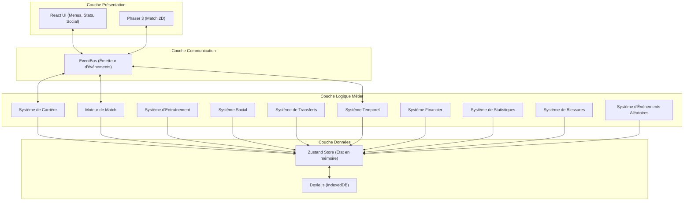
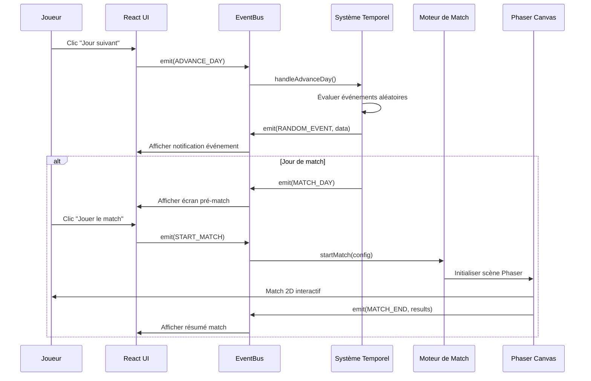

# Document de Conception Technique

## Vue d'ensemble

Ce document décrit l'architecture technique du jeu de carrière footballistique 2D jouable dans le navigateur. Le jeu combine un moteur de rendu 2D (Phaser 3) pour la simulation de matchs avec une interface React pour les menus et la gestion de carrière. L'état du jeu est persisté côté client via IndexedDB (Dexie.js).

### Stack Technique

| Couche | Technologie |
|--------|-------------|
| Rendu 2D (matchs) | Phaser 3 (TypeScript) |
| Interface UI (menus) | React 18 + TypeScript |
| Bundler | Vite 5 |
| Persistance | IndexedDB via Dexie.js |
| State Management | Zustand |
| Styling | Tailwind CSS |
| Tests | Vitest + fast-check |

### Décisions Architecturales Clés

1. **Séparation Phaser/React** : Phaser gère exclusivement le canvas de match 2D. React gère tous les écrans de menu, statistiques, transferts, etc. Communication via un EventBus partagé.
2. **Dexie.js pour IndexedDB** : Wrapper typé pour IndexedDB, permettant des requêtes complexes sur les données de carrière (classements, historiques, effectifs).
3. **Zustand pour l'état applicatif** : Store léger et typé pour l'état en mémoire (session courante), synchronisé avec IndexedDB pour la persistance.
4. **Architecture modulaire** : Chaque système (carrière, match, social, etc.) est un module indépendant avec une interface publique claire.

---

## Architecture

### Diagramme d'Architecture Globale



### Diagramme de Flux Principal



### Structure des Dossiers

```
src/
├── main.tsx                    # Point d'entrée React
├── App.tsx                     # Router principal
├── core/
│   ├── EventBus.ts            # Bus d'événements partagé
│   ├── GameLoop.ts            # Boucle principale du jeu
│   └── types.ts               # Types partagés
├── systems/
│   ├── career/
│   │   ├── CareerSystem.ts
│   │   ├── ContractManager.ts
│   │   └── PromotionEngine.ts
│   ├── match/
│   │   ├── MatchEngine.ts
│   │   ├── MatchSimulator.ts
│   │   ├── ActionResolver.ts
│   │   └── AIMatchSimulator.ts
│   ├── training/
│   │   └── TrainingSystem.ts
│   ├── social/
│   │   ├── SocialSystem.ts
│   │   ├── InterviewGenerator.ts
│   │   └── SocialFeedGenerator.ts
│   ├── transfer/
│   │   └── TransferSystem.ts
│   ├── time/
│   │   ├── TimeSystem.ts
│   │   └── RandomEventEngine.ts
│   ├── finance/
│   │   └── FinanceSystem.ts
│   ├── stats/
│   │   ├── StatsSystem.ts
│   │   └── ProgressionEngine.ts
│   └── injury/
│       └── InjurySystem.ts
├── store/
│   ├── gameStore.ts           # Zustand store principal
│   ├── slices/                # Slices par domaine
│   └── selectors.ts
├── persistence/
│   ├── database.ts            # Configuration Dexie.js
│   ├── serializer.ts          # Sérialisation/Désérialisation
│   └── SaveManager.ts
├── data/
│   ├── clubs/                 # Données statiques des clubs réels
│   │   ├── france.ts
│   │   ├── spain.ts
│   │   ├── england.ts
│   │   ├── italy.ts
│   │   └── germany.ts
│   ├── players/               # Effectifs réels
│   └── config/                # Configuration du jeu
├── ui/
│   ├── screens/               # Écrans React
│   │   ├── MainMenu.tsx
│   │   ├── CharacterCreation.tsx
│   │   ├── ClubSelection.tsx
│   │   ├── Dashboard.tsx
│   │   ├── Training.tsx
│   │   ├── Transfers.tsx
│   │   ├── Statistics.tsx
│   │   ├── SocialFeed.tsx
│   │   ├── Interview.tsx
│   │   ├── MatchPreview.tsx
│   │   ├── MatchSummary.tsx
│   │   └── TrophyCase.tsx
│   ├── components/            # Composants réutilisables
│   └── hooks/                 # Hooks React personnalisés
├── phaser/
│   ├── PhaserGame.tsx         # Composant React wrapper
│   ├── scenes/
│   │   ├── MatchScene.ts      # Scène principale de match
│   │   ├── BootScene.ts
│   │   └── PreloadScene.ts
│   ├── entities/
│   │   ├── Player.ts          # Sprite joueur
│   │   ├── Ball.ts            # Sprite ballon
│   │   └── Pitch.ts           # Terrain
│   └── config.ts              # Configuration Phaser
└── utils/
    ├── random.ts              # Utilitaires aléatoires (seedable)
    ├── math.ts                # Calculs statistiques
    └── formatters.ts          # Formatage dates, nombres
```

---

## Composants et Interfaces

### EventBus

Le bus d'événements est le mécanisme central de communication entre Phaser et React.

```typescript
interface IEventBus {
  emit<T>(event: GameEvent, payload?: T): void;
  on<T>(event: GameEvent, handler: (payload: T) => void): () => void;
  off(event: GameEvent, handler: Function): void;
}

enum GameEvent {
  // Temps
  ADVANCE_DAY = 'advance_day',
  SIMULATE_WEEK = 'simulate_week',
  DAY_ADVANCED = 'day_advanced',
  MATCH_DAY_REACHED = 'match_day_reached',

  // Match
  START_MATCH = 'start_match',
  MATCH_ACTION = 'match_action',
  PLAYER_INPUT = 'player_input',
  MATCH_END = 'match_end',

  // Carrière
  TRANSFER_OFFER = 'transfer_offer',
  CONTRACT_EXPIRED = 'contract_expired',
  SEASON_END = 'season_end',

  // Social
  INTERVIEW_TRIGGERED = 'interview_triggered',
  SOCIAL_POST = 'social_post',

  // Événements
  RANDOM_EVENT = 'random_event',

  // Sauvegarde
  SAVE_GAME = 'save_game',
  LOAD_GAME = 'load_game',
}
```

### Système Temporel (TimeSystem)

```typescript
interface ITimeSystem {
  getCurrentDate(): GameDate;
  advanceDay(): DayResult;
  simulateWeek(): WeekSummary;
  getDaysUntilNextMatch(): number;
  getScheduleForWeek(): WeekSchedule;
}

interface DayResult {
  date: GameDate;
  events: RandomEvent[];
  isMatchDay: boolean;
  activities: DayActivity[];
}

interface WeekSummary {
  startDate: GameDate;
  endDate: GameDate;
  events: RandomEvent[];
  trainingResults: TrainingResult[];
  matchDay: GameDate | null;
}
```

### Moteur de Match (MatchEngine)

```typescript
interface IMatchEngine {
  startMatch(config: MatchConfig): void;
  simulateAIMatch(homeTeam: Team, awayTeam: Team): MatchResult;
  resolveAction(action: MatchAction, playerInput?: PlayerInput): ActionResult;
  getMatchState(): MatchState;
}

interface MatchConfig {
  homeTeam: Team;
  awayTeam: Team;
  playerCharacter: PlayerCharacter;
  competition: Competition;
  matchday: number;
}

interface MatchAction {
  type: 'shot' | 'pass' | 'dribble' | 'tackle' | 'header';
  attacker: MatchPlayer;
  defender: MatchPlayer;
  context: ActionContext;
}

interface ActionResult {
  success: boolean;
  outcome: 'goal' | 'save' | 'miss' | 'intercept' | 'foul' | 'completed';
  xpGained: number;
  ratingImpact: number;
}
```

### Système de Statistiques (StatsSystem)

```typescript
interface IStatsSystem {
  calculateOverallRating(stats: PlayerStats): number;
  updateStatsAfterMatch(performance: MatchPerformance): PlayerStats;
  updateStatsAfterTraining(session: TrainingSession): PlayerStats;
  applyAgingDecay(age: number, stats: PlayerStats): PlayerStats;
  getProgressionRate(currentRating: number, potential: number): number;
  getCareerHistory(): CareerHistory;
}

interface PlayerStats {
  pace: number;        // 1-99
  shooting: number;    // 1-99
  passing: number;     // 1-99
  dribbling: number;   // 1-99
  defending: number;   // 1-99
  physical: number;    // 1-99
}
```

### Système de Transferts (TransferSystem)

```typescript
interface ITransferSystem {
  generateOffers(player: PlayerCharacter, window: TransferWindow): TransferOffer[];
  acceptOffer(offer: TransferOffer): TransferResult;
  rejectOffer(offer: TransferOffer): void;
  simulateAITransfers(clubs: Club[]): AITransferResult[];
  getEligibleClubs(player: PlayerCharacter): Club[];
}

interface TransferOffer {
  id: string;
  fromClub: Club;
  salary: number;
  contractDuration: number; // en saisons
  signingBonus: number;
  division: Division;
  tier: ClubTier;
}
```

### Système Social (SocialSystem)

```typescript
interface ISocialSystem {
  getPopularity(): number;
  getReputation(): number;
  getCoachRelation(): number;
  getTeamRelation(): number;
  generateSocialPosts(event: GameEvent): SocialPost[];
  triggerInterview(context: InterviewContext): Interview;
  processInterviewAnswer(answer: InterviewAnswer): RelationshipImpact;
  publishPlayerPost(postOption: PostOption): PopularityImpact;
}

interface Interview {
  id: string;
  context: InterviewContext;
  questions: InterviewQuestion[];
}

interface InterviewQuestion {
  text: string;
  answers: [InterviewAnswer, InterviewAnswer, InterviewAnswer];
}

interface InterviewAnswer {
  text: string;
  tone: 'humble' | 'confident' | 'controversial';
  impacts: {
    popularity: number;
    reputation: number;
    coachRelation: number;
    teamRelation: number;
  };
}
```

### Système d'Événements Aléatoires (RandomEventEngine)

```typescript
interface IRandomEventEngine {
  evaluateDay(context: DayContext): RandomEvent | null;
  getWeeklyEventCount(): number;
  applyEventEffects(event: RandomEvent): EventEffects;
}

interface RandomEvent {
  id: string;
  category: 'financial' | 'physical' | 'social' | 'relational';
  title: string;
  description: string;
  effects: EventEffects;
  choices?: EventChoice[];
}

interface EventEffects {
  money?: number;
  fitness?: number;
  popularity?: number;
  coachRelation?: number;
  teamRelation?: number;
  injury?: InjuryRisk;
}

interface EventChoice {
  text: string;
  effects: EventEffects;
}
```

### Persistance (SaveManager)

```typescript
interface ISaveManager {
  saveGame(slot: number): Promise<void>;
  loadGame(slot: number): Promise<GameState>;
  listSaves(): Promise<SaveSlot[]>;
  deleteSave(slot: number): Promise<void>;
  exportSave(slot: number): Promise<string>;
  importSave(json: string): Promise<void>;
}

interface SaveSlot {
  slot: number;
  playerName: string;
  clubName: string;
  season: number;
  date: GameDate;
  lastSaved: Date;
  overallRating: number;
}
```

---

## Modèles de Données

### Modèle Principal : GameState

```typescript
interface GameState {
  version: string;
  player: PlayerCharacter;
  career: CareerState;
  time: TimeState;
  social: SocialState;
  finance: FinanceState;
  leagues: LeagueState[];
  saves: SaveMetadata;
}
```

### Joueur Personnage

```typescript
interface PlayerCharacter {
  id: string;
  firstName: string;
  lastName: string;
  nationality: Country;
  position: Position;
  appearance: PlayerAppearance;
  age: number;
  stats: PlayerStats;
  potential: number;          // 1-99, plafond de progression
  overallRating: number;      // 1-99, calculé
  fitness: number;            // 0-100
  morale: number;             // 0-100
  injury: InjuryState | null;
}

type Position = 'GK' | 'CB' | 'LB' | 'RB' | 'CDM' | 'CM' | 'CAM' | 'LW' | 'RW' | 'ST';

interface PlayerAppearance {
  skinTone: number;
  hairStyle: number;
  hairColor: number;
  height: 'short' | 'medium' | 'tall';
}

interface PlayerStats {
  pace: number;
  shooting: number;
  passing: number;
  dribbling: number;
  defending: number;
  physical: number;
}

interface InjuryState {
  type: InjuryType;
  weeksRemaining: number;
  severity: 'minor' | 'moderate' | 'severe';
}

type InjuryType = 'muscle' | 'ligament' | 'fracture' | 'concussion' | 'fatigue';
```

### Club et Effectif

```typescript
interface Club {
  id: string;
  name: string;
  country: Country;
  division: Division;
  tier: ClubTier;
  squad: SquadPlayer[];
  finances: ClubFinances;
  stadium: string;
  colors: { primary: string; secondary: string };
}

type ClubTier = 'small' | 'medium' | 'big';
type Country = 'france' | 'spain' | 'england' | 'italy' | 'germany';

interface Division {
  country: Country;
  level: number;       // 1 = première division, 2 = deuxième, etc.
  name: string;        // ex: "Ligue 1", "Premier League"
}

interface SquadPlayer {
  id: string;
  name: string;
  position: Position;
  age: number;
  overallRating: number;
  potential: number;
  isPlayerCharacter: boolean;
}

interface ClubFinances {
  budget: number;
  wageBill: number;
}
```

### État de Carrière

```typescript
interface CareerState {
  currentClub: Club;
  contract: Contract;
  season: number;
  matchday: number;
  trophies: Trophy[];
  transferHistory: TransferRecord[];
}

interface Contract {
  clubId: string;
  weeklySalary: number;
  bonusPerGoal: number;
  bonusPerAssist: number;
  duration: number;        // en saisons
  seasonsRemaining: number;
  signingBonus: number;
}

interface Trophy {
  id: string;
  type: 'league' | 'cup' | 'top_scorer' | 'best_player' | 'golden_boot';
  season: number;
  competition: string;
}
```

### État Temporel

```typescript
interface TimeState {
  currentDate: GameDate;
  season: number;
  weekday: number;          // 0-6 (lundi-dimanche)
  eventsThisWeek: number;   // compteur pour limiter à 3/semaine
  schedule: MatchSchedule;
}

interface GameDate {
  day: number;
  month: number;
  year: number;
}

interface MatchSchedule {
  nextMatch: ScheduledMatch | null;
  seasonMatches: ScheduledMatch[];
}

interface ScheduledMatch {
  date: GameDate;
  homeTeam: string;   // club ID
  awayTeam: string;   // club ID
  competition: string;
  matchday: number;
}
```

### État Social

```typescript
interface SocialState {
  popularity: number;        // 0-100
  reputation: number;        // 0-100
  coachRelation: number;     // 0-100
  teamRelation: number;      // 0-100
  socialFeed: SocialPost[];
  pendingInterviews: Interview[];
}

interface SocialPost {
  id: string;
  author: string;
  authorType: 'fan' | 'journalist' | 'player' | 'self';
  content: string;
  timestamp: GameDate;
  likes: number;
  sentiment: 'positive' | 'neutral' | 'negative';
}
```

### État Financier

```typescript
interface FinanceState {
  balance: number;
  weeklyIncome: number;
  history: FinanceTransaction[];
}

interface FinanceTransaction {
  date: GameDate;
  type: 'salary' | 'bonus' | 'signing_bonus' | 'sponsorship' | 'fine' | 'event';
  amount: number;
  description: string;
}
```

### Championnat et Classement

```typescript
interface LeagueState {
  division: Division;
  standings: LeagueStanding[];
  results: MatchResult[];
  season: number;
}

interface LeagueStanding {
  clubId: string;
  clubName: string;
  played: number;
  won: number;
  drawn: number;
  lost: number;
  goalsFor: number;
  goalsAgainst: number;
  points: number;
  position: number;
}

interface MatchResult {
  matchday: number;
  homeTeamId: string;
  awayTeamId: string;
  homeGoals: number;
  awayGoals: number;
  playerPerformance?: MatchPerformance;
}

interface MatchPerformance {
  rating: number;          // 1-10
  goals: number;
  assists: number;
  minutesPlayed: number;
  shots: number;
  passAccuracy: number;
  dribbles: number;
  tackles: number;
}
```

### Schéma IndexedDB (Dexie.js)

```typescript
class FootballCareerDB extends Dexie {
  saves!: Table<SaveData, number>;
  clubs!: Table<Club, string>;
  players!: Table<SquadPlayer, string>;
  leagues!: Table<LeagueState, string>;

  constructor() {
    super('FootballCareerGame');
    this.version(1).stores({
      saves: '++slot, playerName, lastSaved',
      clubs: 'id, country, tier, division.level',
      players: 'id, clubId, position, overallRating',
      leagues: '[division.country+division.level], season',
    });
  }
}
```

---

## Algorithmes Clés

### Algorithme de Simulation de Match (IA vs IA)

Pour les matchs entre équipes IA (simulation du championnat), un algorithme probabiliste basé sur les forces relatives :

```
1. Calculer force_home = moyenne(ratings_home) * facteur_domicile(1.1)
2. Calculer force_away = moyenne(ratings_away)
3. expected_goals_home = poisson(lambda = force_home / 25)
4. expected_goals_away = poisson(lambda = force_away / 28)
5. Tirer les buts réels depuis la distribution de Poisson
```

### Algorithme de Résolution d'Action (Match Joueur)

```
1. Calculer probabilité_succès = stat_joueur / (stat_joueur + stat_adversaire)
2. Appliquer modificateur_forme = fitness / 100
3. Appliquer modificateur_moral = morale / 100
4. Si input_joueur.timing == 'perfect': bonus = 0.15
5. Si input_joueur.timing == 'good': bonus = 0.05
6. probabilité_finale = clamp(probabilité_succès * modificateur_forme * modificateur_moral + bonus, 0.05, 0.95)
7. Résultat = random() < probabilité_finale
```

### Algorithme de Progression des Statistiques

```
1. gain_base = intensité_entraînement * facteur_exercice
2. facteur_potentiel = 1 - (current_rating / potential)^2
3. Si current_rating >= 0.8 * potential: facteur_potentiel *= 0.3
4. Si age > 30: appliquer décroissance = (age - 30) * 0.5 par saison (stats physiques)
5. gain_final = gain_base * facteur_potentiel
6. new_stat = clamp(current_stat + gain_final, 1, potential)
```

### Algorithme de Génération d'Offres de Transfert

```
1. Calculer attractivité = (overall_rating * 0.4) + (popularity * 0.3) + (age_factor * 0.3)
2. Filtrer clubs éligibles par tier correspondant à l'attractivité
3. Pour chaque club éligible:
   a. salaire_offert = salaire_actuel * (1 + random(0.1, 0.5))
   b. durée = random(1, 4) saisons
   c. Si club.tier > current_tier: salaire *= 1.5
4. Trier par qualité d'offre, retourner top 3
```

### Algorithme d'Événements Aléatoires

```
1. Pour chaque jour simulé:
   a. Si events_cette_semaine >= 3: skip
   b. probabilité_event = 0.15 (15% par jour)
   c. Si random() < probabilité_event:
      - Choisir catégorie pondérée (financier: 25%, physique: 25%, social: 30%, relationnel: 20%)
      - Générer événement de la catégorie
      - Appliquer effets
      - Incrémenter events_cette_semaine
2. Reset events_cette_semaine chaque lundi
```

---


## Propriétés de Correction (Correctness Properties)

*Une propriété est une caractéristique ou un comportement qui doit rester vrai pour toutes les exécutions valides d'un système — essentiellement, une déclaration formelle de ce que le système doit faire. Les propriétés servent de pont entre les spécifications lisibles par l'humain et les garanties de correction vérifiables par la machine.*

### Property 1: Sérialisation aller-retour (Round-trip)

*Pour tout* état de jeu valide (GameState), sérialiser en JSON puis désérialiser puis sérialiser à nouveau doit produire un JSON identique au premier résultat de sérialisation.

**Validates: Requirements 18.1, 18.2, 18.3, 18.4**

### Property 2: Intégrité des données de clubs

*Pour tout* club dans la base de données, le club doit avoir un tier valide ('small' | 'medium' | 'big'), appartenir à un des cinq pays valides ('france' | 'spain' | 'england' | 'italy' | 'germany'), avoir un effectif non-vide, et chaque joueur de l'effectif doit avoir un poste valide et une note entre 1 et 99.

**Validates: Requirements 3.1, 3.2, 3.3**

### Property 3: Statistiques initiales cohérentes avec le poste

*Pour tout* poste de joueur valide, les statistiques initiales générées doivent être pondérées en faveur des compétences clés de ce poste (ex: un attaquant a un tir supérieur à sa défense, un défenseur a une défense supérieure à son tir).

**Validates: Requirements 2.3**

### Property 4: Invariant du potentiel comme plafond

*Pour toute* opération de progression (entraînement, match), aucune statistique individuelle du joueur ne doit dépasser la valeur de son potentiel.

**Validates: Requirements 8.5, 16.2**

### Property 5: Ralentissement de progression à 80% du potentiel

*Pour tout* joueur dont la note globale est supérieure ou égale à 80% de son potentiel, le taux de progression par session d'entraînement doit être strictement inférieur à celui d'un joueur identique dont la note est inférieure à 80% de son potentiel.

**Validates: Requirements 16.3**

### Property 6: Décroissance physique après 30 ans

*Pour tout* joueur de plus de 30 ans, l'application de la décroissance saisonnière doit réduire les statistiques physiques (pace, physical) d'un montant proportionnel à (âge - 30).

**Validates: Requirements 16.4**

### Property 7: Scores bornés entre 0 et 100

*Pour toute* séquence d'événements affectant la popularité, la réputation, la relation entraîneur ou la relation vestiaire, chacun de ces scores doit rester dans l'intervalle [0, 100] après application des effets.

**Validates: Requirements 10.1, 13.1, 13.2**

### Property 8: Performance influence monotoniquement la popularité

*Pour tout* match où la note du joueur est supérieure à 8, la popularité doit augmenter (ou rester à 100). *Pour tout* match où la note est inférieure à 4, la popularité doit diminuer (ou rester à 0).

**Validates: Requirements 10.2, 10.3**

### Property 9: Calcul correct du classement

*Pour tout* ensemble de résultats de matchs d'une journée de championnat, le classement mis à jour doit refléter correctement les points (3 pour victoire, 1 pour nul, 0 pour défaite), la différence de buts, et les buts marqués pour chaque équipe.

**Validates: Requirements 4.2, 4.4**

### Property 10: Promotions et relégations correctes

*Pour tout* classement de fin de saison valide, les équipes en zone de promotion (top N) doivent être promues à la division supérieure, et les équipes en zone de relégation (bottom M) doivent être reléguées à la division inférieure.

**Validates: Requirements 4.3, 4.5**

### Property 11: Résolution d'action bornée et monotone

*Pour toute* action de match avec des statistiques d'attaquant et de défenseur, la probabilité de succès doit être dans l'intervalle [0.05, 0.95], et une augmentation de la statistique de l'attaquant (toutes choses égales) doit augmenter la probabilité de succès.

**Validates: Requirements 5.4**

### Property 12: Qualité des offres de transfert corrélée au niveau du joueur

*Pour tout* joueur avec une combinaison donnée de note globale, popularité et âge, les offres de transfert générées doivent provenir de clubs dont le tier est cohérent avec le niveau du joueur, et le salaire proposé doit être supérieur ou égal au salaire actuel.

**Validates: Requirements 7.1, 7.5**

### Property 13: Accepter un transfert met à jour l'état correctement

*Pour toute* offre de transfert acceptée, le joueur doit être associé au nouveau club, son contrat doit refléter les termes de l'offre (salaire, durée), et il doit apparaître dans l'effectif du nouveau club.

**Validates: Requirements 7.3**

### Property 14: Refuser toutes les offres préserve l'état

*Pour tout* ensemble d'offres de transfert refusées, le club actuel du joueur, son contrat et sa position dans l'effectif doivent rester inchangés.

**Validates: Requirements 7.4**

### Property 15: Entraînement augmente les compétences ciblées

*Pour toute* session d'entraînement valide ciblant une compétence spécifique, cette compétence doit augmenter (sauf si déjà au potentiel maximum), et l'augmentation doit être proportionnelle à l'intensité choisie.

**Validates: Requirements 6.3**

### Property 16: Risque de blessure après entraînement intensif

*Pour toute* séquence de 3 sessions d'entraînement consécutives à intensité élevée, le risque de blessure du joueur doit être strictement supérieur à celui après 2 sessions ou moins.

**Validates: Requirements 6.4**

### Property 17: Joueur blessé exclu des matchs et entraînement normal

*Pour tout* état de jeu où le joueur est blessé (weeksRemaining > 0), le joueur ne doit pas être sélectionnable pour les matchs, et seuls les exercices de rééducation doivent être disponibles.

**Validates: Requirements 9.3, 9.4**

### Property 18: Maximum trois événements aléatoires par semaine

*Pour toute* semaine simulée (que ce soit jour par jour ou simulation complète), le nombre total d'événements aléatoires déclenchés ne doit pas dépasser 3.

**Validates: Requirements 21.7**

### Property 19: Effets des événements aléatoires appliqués correctement

*Pour tout* événement aléatoire déclenché avec des effets définis (argent, forme, relations, popularité), les attributs correspondants du joueur doivent changer exactement du montant spécifié par l'événement (en respectant les bornes 0-100).

**Validates: Requirements 21.4**

### Property 20: Cohérence entre simulation jour-par-jour et simulation semaine

*Pour toute* semaine donnée, simuler jour par jour (7 appels à advanceDay) doit produire le même ensemble d'événements et le même état final que simuler la semaine entière (1 appel à simulateWeek), à l'exception de la présentation (individuelle vs résumé).

**Validates: Requirements 20.3, 20.4, 21.5, 21.6**

### Property 21: Salaire crédité chaque semaine

*Pour tout* avancement d'une semaine complète, le solde financier du joueur doit augmenter exactement du montant du salaire hebdomadaire défini dans le contrat.

**Validates: Requirements 15.1, 15.2**

### Property 22: Relation entraîneur influence le temps de jeu

*Pour tout* état où la relation entraîneur est inférieure à 30, le temps de jeu du joueur doit être réduit. *Pour tout* état où la relation entraîneur est supérieure à 70, le temps de jeu doit être augmenté.

**Validates: Requirements 13.3, 13.4**

### Property 23: Interview génère exactement 3 réponses par question

*Pour toute* interview générée suite à un événement majeur, chaque question doit proposer exactement 3 réponses prédéfinies avec des tons distincts (humble, confiant, controversé).

**Validates: Requirements 12.1, 12.2**

### Property 24: Réponse controversée génère réactions négatives

*Pour toute* réponse d'interview de ton "controversé", le système social doit générer au moins une publication négative sur le réseau social fictif.

**Validates: Requirements 12.4**

### Property 25: Note globale dans l'intervalle [1, 99]

*Pour tout* ensemble valide de statistiques de joueur (PlayerStats), le calcul de la note globale doit produire une valeur entière dans l'intervalle [1, 99].

**Validates: Requirements 8.3**

---

## Gestion des Erreurs

### Stratégie Générale

| Couche | Stratégie |
|--------|-----------|
| Persistance (IndexedDB) | Try/catch avec fallback localStorage, message utilisateur explicite |
| Sérialisation | Validation de schéma avant désérialisation, rejet des données corrompues |
| Moteur de Match | Valeurs par défaut pour les calculs impossibles, logging des anomalies |
| Système Temporel | Validation des dates, protection contre les boucles infinies |
| Transferts | Validation des offres avant application, rollback en cas d'échec |

### Cas d'Erreur Spécifiques

1. **Stockage indisponible** (Req 17.3) :
   - Détecter l'indisponibilité d'IndexedDB au démarrage
   - Afficher un message explicite : "Impossible de sauvegarder. Vérifiez que votre navigateur autorise le stockage local."
   - Proposer de continuer sans sauvegarde ou de démarrer une nouvelle partie

2. **Données corrompues** :
   - Valider le JSON au chargement avec un schéma Zod
   - Si invalide : proposer de démarrer une nouvelle partie
   - Logger l'erreur pour diagnostic

3. **Dépassement de capacité IndexedDB** :
   - Surveiller l'espace disponible avant chaque sauvegarde
   - Alerter l'utilisateur si l'espace est insuffisant
   - Proposer de supprimer d'anciennes sauvegardes

4. **Erreur de calcul dans le moteur de match** :
   - Borner toutes les probabilités entre 0.05 et 0.95
   - Valider les entrées (stats non-négatives, non-nulles)
   - Fallback sur un résultat neutre en cas d'erreur

5. **État incohérent après transfert** :
   - Vérifier l'intégrité de l'effectif après chaque transfert
   - Si un joueur apparaît dans deux clubs : corriger automatiquement
   - Logger l'anomalie

---

## Stratégie de Tests

### Approche Duale

Le projet utilise une approche de test duale combinant tests unitaires classiques et tests basés sur les propriétés (property-based testing) :

- **Tests unitaires (Vitest)** : Cas spécifiques, cas limites, intégration entre composants
- **Tests de propriétés (fast-check)** : Propriétés universelles vérifiées sur des entrées générées aléatoirement

### Bibliothèque de Property-Based Testing

- **Bibliothèque** : [fast-check](https://github.com/dubzzz/fast-check) (TypeScript natif, intégration Vitest)
- **Configuration** : Minimum 100 itérations par test de propriété
- **Tag format** : `Feature: football-career-game, Property {number}: {property_text}`

### Répartition des Tests

| Module | Tests Unitaires | Tests de Propriétés |
|--------|----------------|---------------------|
| Sérialisation/Persistance | Cas limites (état vide, données corrompues) | Property 1 (round-trip) |
| Données Clubs | Validation structure | Properties 2, 3 |
| Progression/Stats | Cas spécifiques de progression | Properties 4, 5, 6, 25 |
| Scores Sociaux | Cas limites (0, 100) | Properties 7, 8 |
| Championnat | Scénarios de classement | Properties 9, 10 |
| Moteur de Match | Actions spécifiques | Property 11 |
| Transferts | Scénarios d'offres | Properties 12, 13, 14 |
| Entraînement | Sessions spécifiques | Properties 15, 16 |
| Blessures | Types de blessures | Property 17 |
| Événements Aléatoires | Catégories d'événements | Properties 18, 19, 20 |
| Finances | Transactions spécifiques | Property 21 |
| Relations | Seuils de relation | Properties 22, 23, 24 |

### Tests d'Intégration

- Flux complet de création de personnage → sélection club → premier match
- Cycle complet d'une saison (simulation)
- Sauvegarde/chargement avec vérification d'intégrité
- Avancement temporel jour par jour vs simulation semaine

### Tests E2E (Optionnels)

- Navigation entre écrans sur mobile et desktop
- Performance de rendu Phaser (30 FPS)
- Compatibilité navigateurs (Chrome, Safari, Firefox, Edge)

### Exemple de Test de Propriété

```typescript
import { fc } from '@fast-check/vitest';
import { test } from 'vitest';

// Feature: football-career-game, Property 1: Sérialisation aller-retour
test.prop([validGameStateArbitrary], { numRuns: 100 })(
  'serialize(deserialize(serialize(state))) === serialize(state)',
  (state) => {
    const json1 = serialize(state);
    const restored = deserialize(json1);
    const json2 = serialize(restored);
    expect(json2).toEqual(json1);
  }
);

// Feature: football-career-game, Property 18: Maximum trois événements par semaine
test.prop([validWeekContextArbitrary], { numRuns: 100 })(
  'no more than 3 random events per week',
  (weekContext) => {
    const result = simulateWeek(weekContext);
    expect(result.events.length).toBeLessThanOrEqual(3);
  }
);
```
