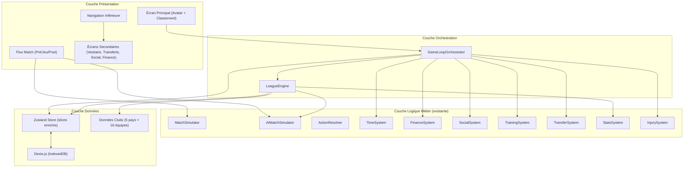
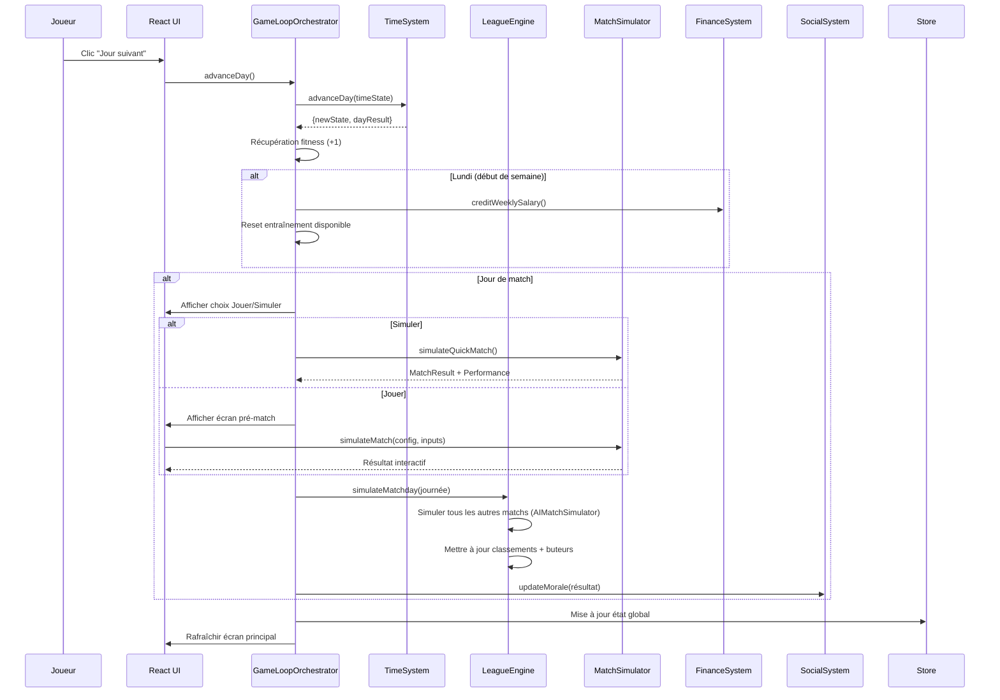
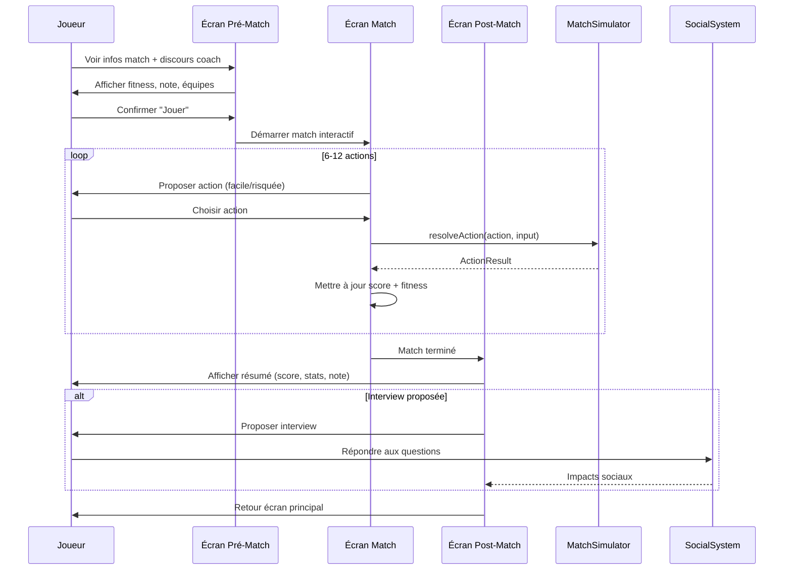

# Document de Conception Technique — Gameplay Loop V2

## Overview

Ce document décrit la conception technique de la version 2 de la boucle de gameplay. L'objectif est d'intégrer les systèmes backend existants (MatchSimulator, AIMatchSimulator, ActionResolver, StatsSystem, TransferSystem, FinanceSystem, TimeSystem, SocialSystem, TrainingSystem) dans une boucle de jeu cohérente avec une interface utilisateur repensée.

### Objectifs Principaux

1. **Système de Ligue complet** : 5 championnats de 18 équipes avec calendrier de 34 journées
2. **Boucle de jeu intégrée** : Avancement du temps → événements → match → mise à jour des classements
3. **UI repensée** : Écran principal scrollable, navigation inférieure par onglets, avatar visible
4. **Match enrichi** : Option jouer/simuler, écran pré-match avec discours coach, post-match avec interview
5. **Entraînement significatif** : Une session hebdomadaire unique avec impact fort (1-3 points)
6. **Fitness stratégique** : Diminution en match (15-30 pts), récupération quotidienne (~1 pt/jour)

### Stack Technique (inchangée)

| Couche | Technologie |
|--------|-------------|
| Rendu 2D (matchs) | Phaser 4 (TypeScript) |
| Interface UI | React 19 + TypeScript |
| Bundler | Vite 8 |
| Persistance | IndexedDB via Dexie.js |
| State Management | Zustand 5 (slices) |
| Styling | Tailwind CSS 4 |
| Tests | Vitest + fast-check |
| Validation | Zod |

### Décisions Architecturales Clés

1. **Extension du store existant** : Ajout d'un `leagueSlice` enrichi (multi-championnats, buteurs) et d'un `uiSlice` pour la navigation
2. **GameLoopOrchestrator** : Nouveau module central qui coordonne l'avancement du temps et déclenche les systèmes dans le bon ordre
3. **LeagueEngine** : Nouveau module pour la génération de calendrier et la simulation de journées complètes
4. **Réutilisation maximale** : Les systèmes existants (AIMatchSimulator, MatchSimulator, FinanceSystem, SocialSystem, TimeSystem) sont utilisés tels quels via le GameLoopOrchestrator
5. **UI mobile-first** : Navigation inférieure fixe, écran principal scrollable, composants React modulaires

---

## Architecture

### Diagramme d'Architecture V2



### Diagramme de Flux — Avancement d'un Jour



### Diagramme de Flux — Match Joué



### Structure des Nouveaux Fichiers

```
src/
├── core/
│   └── GameLoopOrchestrator.ts    # NOUVEAU - Orchestrateur principal
├── systems/
│   └── league/
│       ├── LeagueEngine.ts        # NOUVEAU - Gestion des championnats
│       ├── ScheduleGenerator.ts   # NOUVEAU - Génération calendrier 34 journées
│       ├── StandingsCalculator.ts # NOUVEAU - Calcul classements + tri
│       └── TopScorers.ts          # NOUVEAU - Classement buteurs
├── store/
│   └── slices/
│       ├── leagueSlice.ts         # ENRICHI - Multi-championnats + buteurs
│       └── uiSlice.ts             # NOUVEAU - État navigation UI
├── ui/
│   ├── screens/
│   │   ├── MainScreen.tsx         # NOUVEAU - Écran principal redessiné
│   │   ├── MatchChoice.tsx        # NOUVEAU - Choix jouer/simuler
│   │   ├── PreMatch.tsx           # NOUVEAU - Écran pré-match
│   │   ├── MatchPlay.tsx          # NOUVEAU - Match interactif
│   │   ├── PostMatch.tsx          # NOUVEAU - Résumé post-match
│   │   ├── Locker.tsx             # NOUVEAU - Vestiaire
│   │   ├── Standings.tsx          # NOUVEAU - Classements multi-ligues
│   │   ├── Training.tsx           # NOUVEAU - Entraînement hebdomadaire
│   │   └── AvatarCreation.tsx     # NOUVEAU - Création d'avatar
│   ├── components/
│   │   ├── Avatar.tsx             # NOUVEAU - Composant avatar
│   │   ├── BottomNav.tsx          # NOUVEAU - Navigation inférieure
│   │   ├── StandingsTable.tsx     # NOUVEAU - Tableau classement
│   │   ├── TopScorersTable.tsx    # NOUVEAU - Tableau buteurs
│   │   ├── FitnessBar.tsx         # NOUVEAU - Jauge fitness
│   │   ├── MoraleIndicator.tsx    # NOUVEAU - Indicateur moral
│   │   └── CoachSpeech.tsx        # NOUVEAU - Discours entraîneur
│   └── hooks/
│       ├── useGameLoop.ts         # NOUVEAU - Hook orchestration
│       └── useNavigation.ts       # NOUVEAU - Hook navigation
└── data/
    └── clubs/                     # ENRICHI - 18 équipes par pays (90 total)
```

---

## Components and Interfaces

### GameLoopOrchestrator

Le composant central qui coordonne l'avancement du temps et déclenche les systèmes dans le bon ordre.

```typescript
interface IGameLoopOrchestrator {
  advanceDay(): DayAdvanceResult;
  simulateWeek(): WeekAdvanceResult;
  playMatch(config: MatchConfig, playerInputs: PlayerInput[]): MatchCompleteResult;
  simulateMatch(config: MatchConfig): MatchCompleteResult;
  executeTraining(skill: TrainingSkill): TrainingResult;
}

interface DayAdvanceResult {
  dayResult: DayResult;
  fitnessRecovery: number;
  isMatchDay: boolean;
  matchConfig?: MatchConfig;
  salaryCredited: boolean;
  trainingReset: boolean;
}

interface WeekAdvanceResult {
  days: DayAdvanceResult[];
  matchResults: MatchResult[];
  standingsUpdated: boolean;
}

interface MatchCompleteResult {
  result: MatchResult;
  performance: MatchPerformance;
  fitnessLoss: number;
  moraleChange: number;
  standingsUpdated: boolean;
  topScorersUpdated: boolean;
}
```

### LeagueEngine

Gère la génération de calendrier, la simulation de journées et le calcul des classements.

```typescript
interface ILeagueEngine {
  generateSeasonSchedule(clubs: Club[]): ScheduledMatch[];
  simulateMatchday(matchday: number, leagues: LeagueState[]): MatchdayResult;
  calculateStandings(results: MatchResult[], clubs: Club[]): LeagueStanding[];
  sortStandings(standings: LeagueStanding[]): LeagueStanding[];
  updateTopScorers(matchday: number, results: MatchResult[]): TopScorer[];
}

interface MatchdayResult {
  matchday: number;
  results: MatchResult[];
  updatedStandings: LeagueStanding[];
  updatedTopScorers: TopScorer[];
}

interface TopScorer {
  playerId: string;
  playerName: string;
  clubId: string;
  clubName: string;
  goals: number;
  assists: number;
  matchesPlayed: number;
}
```

### ScheduleGenerator

Génère un calendrier complet de 34 journées (aller-retour) pour 18 équipes.

```typescript
interface IScheduleGenerator {
  generateRoundRobin(clubIds: string[], season: number): ScheduledMatch[];
  assignDates(matches: ScheduledMatch[], startDate: GameDate): ScheduledMatch[];
}
```

### StandingsCalculator

Calcule et trie les classements selon les règles : points > différence de buts > buts marqués.

```typescript
interface IStandingsCalculator {
  calculateFromResults(results: MatchResult[], clubs: Club[]): LeagueStanding[];
  sortStandings(standings: LeagueStanding[]): LeagueStanding[];
  getPosition(clubId: string, standings: LeagueStanding[]): number;
}
```

### FitnessManager (logique intégrée au GameLoopOrchestrator)

```typescript
interface IFitnessManager {
  applyMatchFatigue(fitness: number, matchIntensity: number): number;
  applyDailyRecovery(fitness: number): number;
  clampFitness(fitness: number): number;
  getFitnessModifier(fitness: number): number;
}

// Constantes
const MATCH_FITNESS_LOSS = { min: 15, max: 30 };
const DAILY_RECOVERY = 1;
const LOW_FITNESS_THRESHOLD = 50;
```

### TrainingManager (extension du TrainingSystem existant)

```typescript
interface ITrainingManager {
  isTrainingAvailable(trainedThisWeek: boolean): boolean;
  executeWeeklyTraining(player: PlayerCharacter, skill: TrainingSkill): TrainingResult;
  calculateSignificantGain(currentStat: number, potential: number): number;
}

// Gain significatif : entre 1 et 3 points selon le potentiel restant
const TRAINING_GAIN = { min: 1, max: 3 };
```

### MatchChoiceFlow

```typescript
interface IMatchChoiceFlow {
  getPreMatchInfo(config: MatchConfig, player: PlayerCharacter, coachRelation: number): PreMatchInfo;
  generateCoachSpeech(matchImportance: number, coachRelation: number): string;
  simulateQuickMatch(config: MatchConfig, player: PlayerCharacter): MatchCompleteResult;
}

interface PreMatchInfo {
  homeTeam: { name: string; avgRating: number };
  awayTeam: { name: string; avgRating: number };
  coachSpeech: string;
  playerFitness: number;
  playerRating: number;
  competition: string;
  matchday: number;
}
```

### UI Components

```typescript
// Navigation inférieure
interface BottomNavProps {
  activeTab: NavTab;
  onTabChange: (tab: NavTab) => void;
}

type NavTab = 'home' | 'club' | 'person' | 'trophy';

// Écran principal
interface MainScreenProps {
  player: PlayerCharacter;
  standings: LeagueStanding[];
  nextMatch: ScheduledMatch | null;
  currentDate: GameDate;
  trainingAvailable: boolean;
  onAdvanceDay: () => void;
  onSimulateWeek: () => void;
  onTrain: () => void;
}

// Vestiaire
interface LockerProps {
  squad: SquadPlayer[];
  teamMorale: number;
}
```

---

## Data Models

### Extensions au GameState

```typescript
interface GameStateV2 extends GameState {
  // Enrichissement du LeagueState existant
  leagues: LeagueStateV2[];
  // Nouvel état UI
  ui: UIState;
  // Entraînement hebdomadaire
  training: WeeklyTrainingState;
}

interface LeagueStateV2 extends LeagueState {
  topScorers: TopScorer[];
  schedule: ScheduledMatch[];  // Calendrier complet de la saison
}

interface UIState {
  activeTab: NavTab;
  currentScreen: ScreenType;
}

type ScreenType = 
  | 'main' 
  | 'standings' 
  | 'locker' 
  | 'training'
  | 'match-choice'
  | 'pre-match'
  | 'match-play'
  | 'post-match'
  | 'transfers'
  | 'social'
  | 'finance'
  | 'trophies';

interface WeeklyTrainingState {
  trainedThisWeek: boolean;
  lastTrainingDate: GameDate | null;
}
```

### TopScorer

```typescript
interface TopScorer {
  playerId: string;
  playerName: string;
  clubId: string;
  clubName: string;
  goals: number;
  assists: number;
  matchesPlayed: number;
}
```

### TeamMorale (extension du SocialState)

```typescript
interface SocialStateV2 extends SocialState {
  teamMorale: number;  // 0-100, indicateur collectif du vestiaire
}
```

### MatchDay Flow Data

```typescript
interface MatchDayContext {
  matchConfig: MatchConfig;
  isPlayerMatch: boolean;
  matchday: number;
  competition: string;
}

interface QuickSimResult {
  result: MatchResult;
  performance: MatchPerformance;
  fitnessLoss: number;
}
```

### Données Clubs Enrichies

Chaque pays doit avoir exactement 18 clubs pour former un championnat complet :

```typescript
// Structure par pays (existante, à compléter à 18 clubs)
// france.ts : 18 clubs Ligue 1
// england.ts : 18 clubs Premier League
// germany.ts : 18 clubs Bundesliga (note: 18 en réalité)
// italy.ts : 18 clubs Serie A (note: 20 en réalité, on prend 18)
// spain.ts : 18 clubs La Liga (note: 20 en réalité, on prend 18)
```

### Algorithme de Génération de Calendrier (Round-Robin)

```
Pour 18 équipes, générer 34 journées (17 aller + 17 retour) :
1. Numéroter les équipes 1-18
2. Fixer l'équipe 1, faire tourner les 17 autres (algorithme du cercle)
3. Pour chaque rotation, générer les 9 matchs de la journée
4. Journées 18-34 = inverse domicile/extérieur des journées 1-17
5. Assigner les dates : 1 journée par semaine (samedi), début août
```

### Algorithme de Tri des Classements

```
Trier les standings par :
1. Points (décroissant)
2. Différence de buts (décroissant)
3. Buts marqués (décroissant)
4. Nom du club (alphabétique, pour stabilité)
```

### Algorithme de Simulation Rapide (Match Simulé)

```
1. Calculer force_home = moyenne(ratings_home)
2. Calculer force_away = moyenne(ratings_away)
3. Résultat = AIMatchSimulator.simulateAIMatch(home, away, matchday)
4. Performance joueur :
   - rating = (overallRating / 10) * (fitness / 100) + random(-1, 1)
   - goals = poisson(lambda = rating * 0.15) si attaquant/milieu
   - assists = poisson(lambda = rating * 0.1)
5. fitnessLoss = randomInt(15, 30)
```

### Algorithme du Discours Coach

```
1. importance = (matchday > 30) ? 'crucial' : (position <= 3) ? 'important' : 'normal'
2. Si coachRelation > 70 : ton = 'encourageant'
3. Si coachRelation 40-70 : ton = 'neutre'
4. Si coachRelation < 40 : ton = 'froid'
5. Sélectionner message template basé sur (importance, ton)
```

### Algorithme du Moral d'Équipe

```
1. Après victoire : teamMorale += randomInt(3, 8)
2. Après défaite : teamMorale -= randomInt(3, 8)
3. Après nul : teamMorale += randomInt(-2, 2)
4. Influence coach : teamMorale += (coachRelation - 50) * 0.05 par jour
5. Borner teamMorale entre [0, 100]
```


---

## Correctness Properties

*A property is a characteristic or behavior that should hold true across all valid executions of a system — essentially, a formal statement about what the system should do. Properties serve as the bridge between human-readable specifications and machine-verifiable correctness guarantees.*

### Property 1: Schedule Generation Produces Valid Round-Robin

*For any* set of exactly 18 clubs, the generated season schedule SHALL produce exactly 34 matchdays where each team plays exactly 34 matches (17 home, 17 away), each pair of teams meets exactly twice (once home, once away), and each team plays exactly once per matchday.

**Validates: Requirements 1.3**

### Property 2: Matchday Simulation Completeness

*For any* matchday with N scheduled matches, simulating that matchday SHALL produce exactly N match results, one for each scheduled match, with valid scores (non-negative integers).

**Validates: Requirements 1.4**

### Property 3: Standings Calculation Correctness

*For any* set of match results, the calculated standings SHALL correctly reflect: points = 3×wins + 1×draws, goals for = sum of goals scored, goals against = sum of goals conceded, and standings SHALL be sorted by points descending, then goal difference descending, then goals for descending.

**Validates: Requirements 1.5, 2.3, 2.4, 9.6**

### Property 4: Top Scorers Accumulation

*For any* sequence of match results containing goal scorers, the top scorers list SHALL correctly sum the total goals per player across all matchdays, and the list SHALL be sorted by goals descending.

**Validates: Requirements 3.1, 3.3**

### Property 5: Team Morale Bounded and Monotonic with Results

*For any* team morale value in [0, 100], a win SHALL increase morale (or keep at 100), a loss SHALL decrease morale (or keep at 0), and the resulting morale SHALL always remain in [0, 100].

**Validates: Requirements 4.2, 4.3, 4.4**

### Property 6: Training Limited to Once Per Week

*For any* game state where training has already been executed this week, attempting to train again SHALL be rejected and the player's stats SHALL remain unchanged.

**Validates: Requirements 5.1, 5.4**

### Property 7: Training Gain Bounded Between 1 and 3

*For any* player whose targeted stat is below their potential, executing a weekly training session SHALL increase the targeted stat by at least 1 and at most 3 points.

**Validates: Requirements 5.3**

### Property 8: Stronger Team Wins More Often in Simulation

*For any* two teams where team A has a strictly higher average squad rating than team B, over a large number of simulated matches, team A SHALL win more often than team B.

**Validates: Requirements 6.2**

### Property 9: Match Action Count Bounded

*For any* interactive match simulation, the number of player actions generated SHALL be between 6 and 12 (inclusive).

**Validates: Requirements 8.2**

### Property 10: Action Probability Monotonic with Stats and Fitness

*For any* match action, increasing the attacker's overall rating (all else equal) SHALL increase the success probability, and increasing fitness (all else equal) SHALL increase the success probability. The probability SHALL always be clamped to [0.05, 0.95].

**Validates: Requirements 8.4, 10.4**

### Property 11: Successful Actions Produce Correct Outcomes

*For any* match action that succeeds, if the action type is 'shot' the outcome SHALL be 'goal', and if the action type is 'pass' the outcome SHALL be 'completed' (with potential assist attribution).

**Validates: Requirements 8.5, 8.6**

### Property 12: Match Fitness Loss Bounded

*For any* match (played or simulated), the player's fitness loss SHALL be between 15 and 30 points (inclusive), and the resulting fitness after the match SHALL be less than the fitness before the match.

**Validates: Requirements 8.7, 10.1**

### Property 13: Fitness Always Bounded [0, 100]

*For any* sequence of fitness modifications (match fatigue, daily recovery, training), the player's fitness SHALL always remain in the interval [0, 100].

**Validates: Requirements 10.3**

### Property 14: Daily Fitness Recovery on Non-Match Days

*For any* day advance where no match is played, the player's fitness SHALL increase by approximately 1 point (clamped at 100).

**Validates: Requirements 10.2**

### Property 15: Weekly Salary Correctly Credited

*For any* complete week advance, the player's financial balance SHALL increase by exactly the weekly salary amount defined in their contract.

**Validates: Requirements 14.5**

### Property 16: Avatar Appearance Round-Trip

*For any* valid player appearance configuration (skinTone, hairStyle, hairColor, height), saving the appearance to the game state and reading it back SHALL produce an identical appearance object.

**Validates: Requirements 11.3**

---

## Error Handling

### Stratégie Générale

| Couche | Stratégie |
|--------|-----------|
| GameLoopOrchestrator | Try/catch autour de chaque système, logging des erreurs, état cohérent garanti |
| LeagueEngine | Validation des données d'entrée (18 clubs, matchday valide), fallback sur résultat 0-0 |
| MatchSimulator | Bornes sur toutes les probabilités [0.05, 0.95], valeurs par défaut pour inputs manquants |
| FitnessManager | Clamping systématique [0, 100] après chaque modification |
| TrainingManager | Vérification de l'état (déjà entraîné, blessé) avant exécution |
| UI Components | États de chargement, messages d'erreur utilisateur, fallback gracieux |

### Cas d'Erreur Spécifiques

1. **Données de clubs insuffisantes** (< 18 clubs pour un pays) :
   - Détecter au démarrage de la saison
   - Générer des clubs fictifs pour compléter à 18
   - Logger un avertissement

2. **Calendrier incohérent** (match sans équipe valide) :
   - Valider chaque match avant simulation
   - Ignorer les matchs invalides et logger l'erreur
   - Ne pas bloquer la progression du jeu

3. **Fitness négative après match** :
   - Clamper à 0 systématiquement
   - Afficher un avertissement "joueur épuisé"

4. **Entraînement sur joueur blessé** :
   - Vérifier `player.injury === null` avant d'autoriser
   - Afficher message "Entraînement impossible : joueur blessé"
   - Proposer uniquement la rééducation

5. **Classement corrompu** (somme des matchs joués incohérente) :
   - Recalculer le classement depuis les résultats bruts
   - Logger l'incohérence détectée

6. **Simulation de match sans adversaire** :
   - Vérifier que les deux équipes existent dans le calendrier
   - Fallback : victoire par forfait 3-0

---

## Testing Strategy

### Approche Duale

Le projet utilise une approche de test duale :

1. **Tests unitaires (Vitest)** : Vérifient des exemples spécifiques, cas limites et conditions d'erreur
2. **Tests property-based (fast-check)** : Vérifient les propriétés universelles sur des entrées générées aléatoirement

### Property-Based Testing Configuration

- **Bibliothèque** : `fast-check` (déjà installée dans le projet)
- **Minimum 100 itérations** par test de propriété
- **Tag format** : `Feature: gameplay-loop-v2, Property {number}: {property_text}`

### Plan de Tests

#### Tests Property-Based (fast-check)

| Property | Module Testé | Fichier de Test |
|----------|-------------|-----------------|
| P1: Schedule Round-Robin | ScheduleGenerator | `systems/league/schedule.property.test.ts` |
| P2: Matchday Completeness | LeagueEngine | `systems/league/league.property.test.ts` |
| P3: Standings Calculation | StandingsCalculator | `systems/league/standings.property.test.ts` |
| P4: Top Scorers | TopScorers | `systems/league/topscorers.property.test.ts` |
| P5: Morale Bounded | SocialSystem (V2) | `systems/social/morale.property.test.ts` |
| P6: Training Once/Week | GameLoopOrchestrator | `core/gameloop.property.test.ts` |
| P7: Training Gain [1,3] | TrainingSystem (V2) | `systems/training/training.property.test.ts` |
| P8: Stronger Team Wins | AIMatchSimulator | `systems/match/simulation.property.test.ts` |
| P9: Action Count [6,12] | MatchSimulator | `systems/match/match.property.test.ts` |
| P10: Probability Monotonic | ActionResolver | `systems/match/action.property.test.ts` |
| P11: Correct Outcomes | ActionResolver | `systems/match/action.property.test.ts` |
| P12: Fitness Loss [15,30] | FitnessManager | `systems/match/fitness.property.test.ts` |
| P13: Fitness Bounded | FitnessManager | `systems/match/fitness.property.test.ts` |
| P14: Daily Recovery | GameLoopOrchestrator | `core/gameloop.property.test.ts` |
| P15: Salary Credited | FinanceSystem | `systems/finance/finance.property.test.ts` |
| P16: Appearance Round-Trip | Serializer | `persistence/serializer.property.test.ts` |

#### Tests Unitaires (exemples et edge cases)

| Domaine | Cas de Test | Fichier |
|---------|-------------|---------|
| LeagueEngine | Initialisation 5 ligues, 18 équipes chacune | `systems/league/league.test.ts` |
| Standings | Cas d'égalité parfaite (même points, même GD) | `systems/league/standings.test.ts` |
| Match Choice | UI affiche 2 options le jour du match | `ui/screens/MatchChoice.test.tsx` |
| Pre-Match | Discours coach varie selon relation | `ui/screens/PreMatch.test.tsx` |
| Post-Match | Interview proposée après match | `ui/screens/PostMatch.test.tsx` |
| Navigation | Tous les onglets accessibles | `ui/components/BottomNav.test.tsx` |
| Avatar | Toutes les options de personnalisation | `ui/screens/AvatarCreation.test.tsx` |
| Main Screen | Affichage date, prochain match, fitness | `ui/screens/MainScreen.test.tsx` |
| Locker | Affichage effectif complet + moral | `ui/screens/Locker.test.tsx` |
| Training | Désactivé après utilisation | `ui/screens/Training.test.tsx` |

#### Tests d'Intégration

| Scénario | Systèmes Impliqués | Fichier |
|----------|---------------------|---------|
| Avancement jour complet | GLO + Time + Fitness + Events | `integration/dayAdvance.test.ts` |
| Journée de match complète | GLO + League + Match + Standings | `integration/matchday.test.ts` |
| Semaine complète | GLO + Finance + Training + Time | `integration/weekSimulation.test.ts` |
| Transfert window | GLO + Transfer + Career | `integration/transfer.test.ts` |

### Générateurs fast-check

```typescript
// Générateur de clubs (18 par ligue)
const clubArb = fc.record({
  id: fc.uuid(),
  name: fc.string({ minLength: 3, maxLength: 20 }),
  squad: fc.array(squadPlayerArb, { minLength: 11, maxLength: 25 }),
  // ...
});

// Générateur de résultats de match
const matchResultArb = fc.record({
  matchday: fc.integer({ min: 1, max: 34 }),
  homeTeamId: fc.uuid(),
  awayTeamId: fc.uuid(),
  homeGoals: fc.integer({ min: 0, max: 8 }),
  awayGoals: fc.integer({ min: 0, max: 8 }),
});

// Générateur de standings
const standingArb = fc.record({
  clubId: fc.uuid(),
  played: fc.integer({ min: 0, max: 34 }),
  won: fc.integer({ min: 0, max: 34 }),
  drawn: fc.integer({ min: 0, max: 34 }),
  lost: fc.integer({ min: 0, max: 34 }),
  goalsFor: fc.integer({ min: 0, max: 100 }),
  goalsAgainst: fc.integer({ min: 0, max: 100 }),
  points: fc.integer({ min: 0, max: 102 }),
});

// Générateur de fitness
const fitnessArb = fc.integer({ min: 0, max: 100 });

// Générateur de morale
const moraleArb = fc.integer({ min: 0, max: 100 });

// Générateur de player stats
const playerStatsArb = fc.record({
  pace: fc.integer({ min: 1, max: 99 }),
  shooting: fc.integer({ min: 1, max: 99 }),
  passing: fc.integer({ min: 1, max: 99 }),
  dribbling: fc.integer({ min: 1, max: 99 }),
  defending: fc.integer({ min: 1, max: 99 }),
  physical: fc.integer({ min: 1, max: 99 }),
});
```
